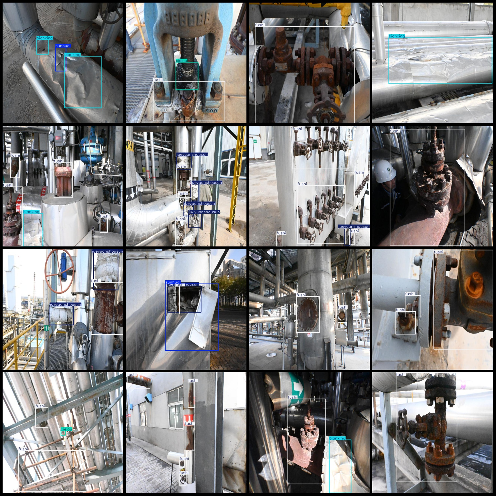
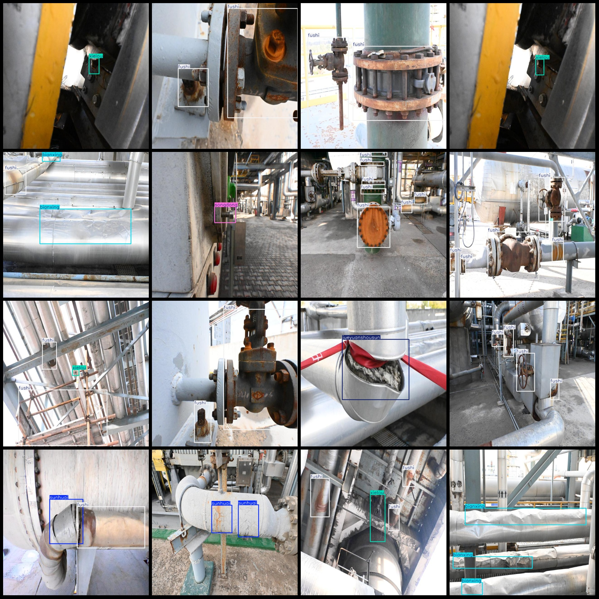

# Smart Factory Tank Surface Defects Detection Dataset in VOC+YOLO Format with 1,104 Images in 6 Categories

dataset format: Pascal VOC format+YOLO format(without split path's text file, only containing jpg image and corresponding VOC format xml file and yolo format text file)

number of images: 1104
annotation count: 1104
annotation count: 1104
Label count: 6
Annotation class names: ["bianxing", "fushi", "jueyuanshousun", "songdong", "sunhuai", "xielou"]
["Deformation", "Corrosion", "Insulation Leakage", "Looseness", "Damage", "Leakage"]
Number of boxes per category
bianxing box count = 180
fushi box count = 2592
jueyuanshousun box count = 305
Songdong's frame count = 23
sunhuai box count = 204
xielou box count = 143
Total Frames: 3447
images per class: 
Bianxing has 113 images.
fushi images = 901
jueyuanshousun images = 228
songdong images = 20
sunhuai images = 158
xielou images = 143
Image Resolution: 640x640
Use annotation tool: labelImg
Annotation rules: draw a rectangle box around the class.
Important note: The dataset does not have separate training, validation, and test sets.
Special notice: This dataset does not guarantee the accuracy of the trained model or weight files.
Preview of the image:
## Images

Here is a pay link on Stripe ( https://buy.stripe.com/3cs8yP7sY87d0vu9AB ). Please contact me lonlonago@foxmail.com after funding $89, and I will send you a complete data files , thank you!

